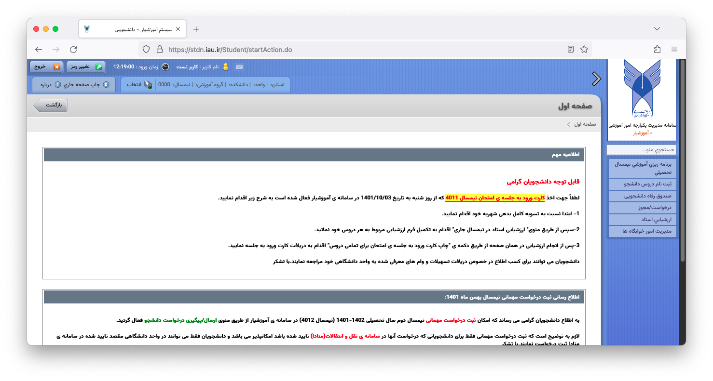
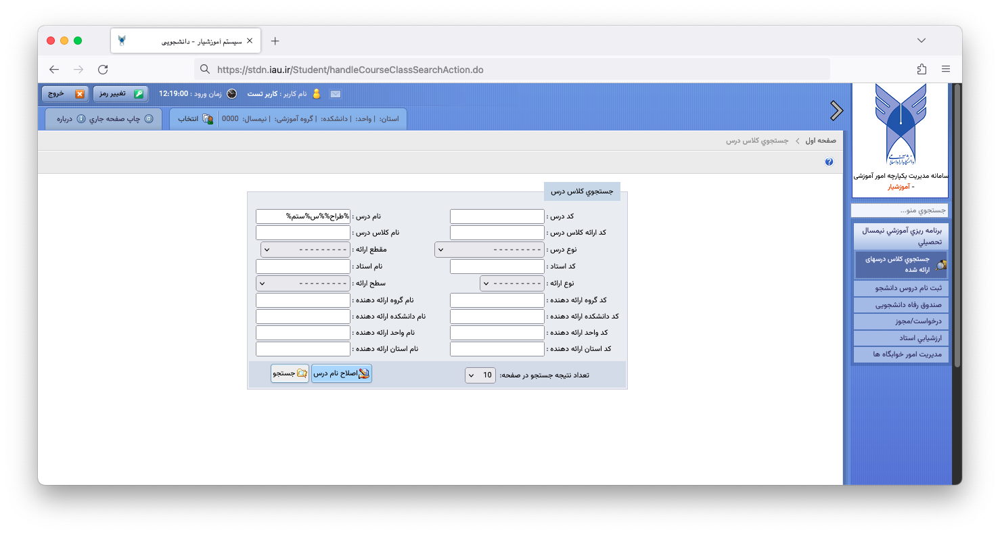
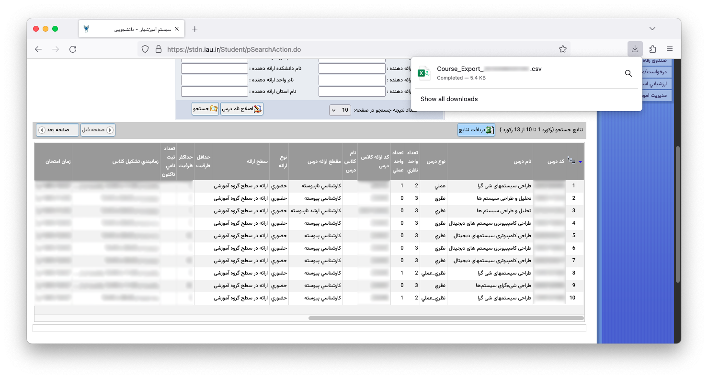

<div dir="rtl">
<!-- Logo -->
<div align="center">
  <a href="https://github.com/github_username/repo_name">
    
  </a>

<!-- Title -->
<h3 align="center">آموزشیار بهتر</h3>
  <p align="center">
    <a href="README.md">English</a>
    |
    <a href="README-fa.md">فارسی</a>
  </p>
</div>

<!-- ToC -->
<details>
  <summary>فهرست</summary>
  <ol>
    <li>
      <a href="#درباره">درباره</a>
    </li>
    <li>
      <a href="#ویژگی‌ها">ویژگی‌ها</a>
      <ul>
        <li><a href="#تغییرات-ظاهری">تغییرات ظاهری</a></li>
        <li><a href="#اصلاح-نام-درس">اصلاح نام درس</a></li>
        <li><a href="#دریافت-نتایج-جست‌وجو">دریافت نتایج جست‌وجو</a></li>
      </ul>
    </li>
    <li>
      <a href="#نصب-افزونه">نصب افزونه</a>
      <ul>
        <li><a href="#نصب-از-طریق-فایل">نصب از طریق فایل</a></li>
        <li><a href="#نصب-موقت">نصب موقت</a></li>
      </ul>
    </li>
    <li><a href="#سازگاری">سازگاری</a></li>
    <li><a href="#حریم-شخصی">حریم شخصی</a></li>
    <li><a href="#مشارکت">مشارکت</a></li>
  </ol>
</details>

## درباره
این افزونه ساده ویژگی‌هایی که به صورت پیش‌فرض در سامانه آموزشیار وجود ندارد را به آن اضافه می‌کند.

**آموزشیار بهتر** همچنان در مرحله توسعه بوده و **استفاده از آن به عهده شخص استفاده کننده می‌باشد.**

## ویژگی‌ها

### تغییرات ظاهری:

<div align="center">

اعمال سرتاسری فونت وزیرمتن برای خوانایی و ظاهر بهتر
</div>

### اصلاح نام درس:

<div align="center">

اصلاح نام درس به هنگام جست‌وجوی یک درس
</div>

### دریافت نتایج جست‌وجو:

<div align="center">

دریافت نتایج جست‌وجو برای یک درس در قالب فایل اکسل
</div>

## نصب افزونه

```آموزشیار بهتر``` در این لحظه فقط با مرورگر **فایرفاکس** سازگار است.

### نصب از طریق فایل:

ابتدا آخرین نسخه امضا شده افزونه با فرمت ```xpi``` را از [اینجا](https://github.com/alireza1219/better-amoozeshyar/releases/) دانلود کنید.

در فایرفاکس به آدرس ```about:addons``` رفته و بر روی آیکون ⚙️ کلیک کنید.

حال گزینه ```Install Add-on From File``` را انتخاب کرده و به محل دانلود فایل افزونه با فرمت ```xpi``` رفته و آن را باز کنید.

افزونه نصب و فعال شد. می‌توانید از همین صفحه افزونه را غیرفعال یا حذف کنید.

### نصب موقت:

**تنها در صورت نیاز به توسعه افزونه از این روش استفاده کنید.**

سورس افزونه را Clone کنید.

در فایرفاکس به آدرس ```about:debugging``` بروید.

حال بر روی گزینه ```This Firefox``` کلیک و سپس ```Load Temporary Add-on...``` را انتخاب نمایید.

در انتها فایل ```manifest.json``` مربوط به افزونه را باز کنید.

با استفاده از ```Remove``` می‌توانید تغییرات اعمال شده را بازگردانی کرده و افزونه را حذف کنید.


## سازگاری

نسخه 48.0 فایرفاکس یا بالاتر

## حریم شخصی

این افزونه به اطلاعات شما بر روی آموزشیار دسترسی ندارد.


## مشارکت

باگ‌ها و درخواست ویژگی‌های تازه را با باز کردن یک Issue گزارش کنید.

😊 شما نیز می‌توانید در توسعه این افزونه سهیم شوید!
</div>